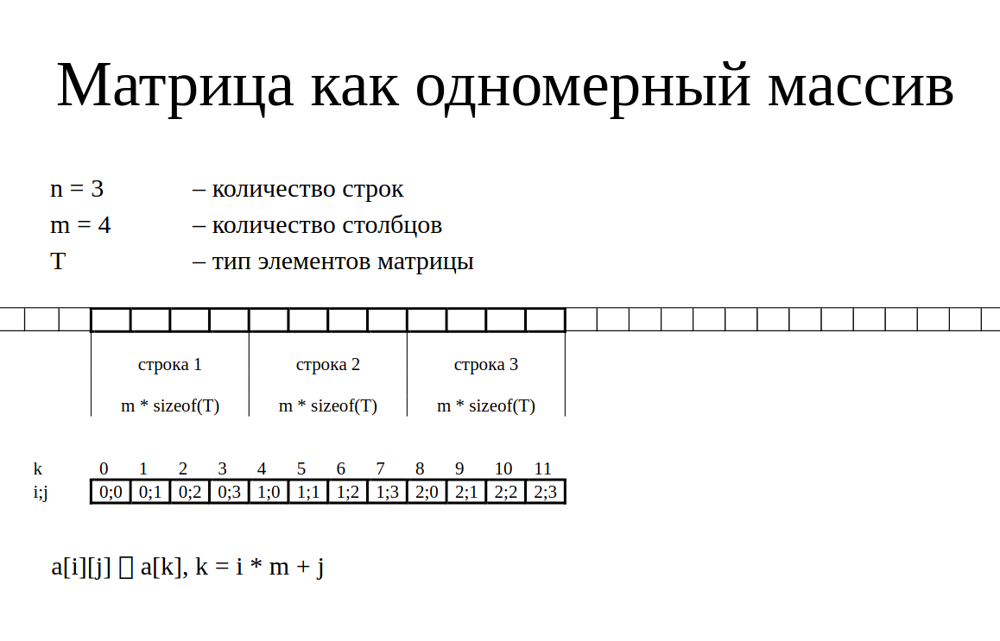
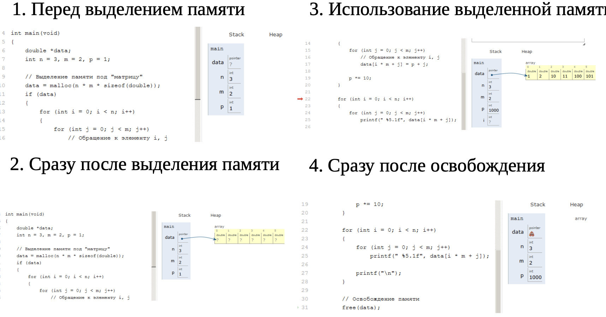
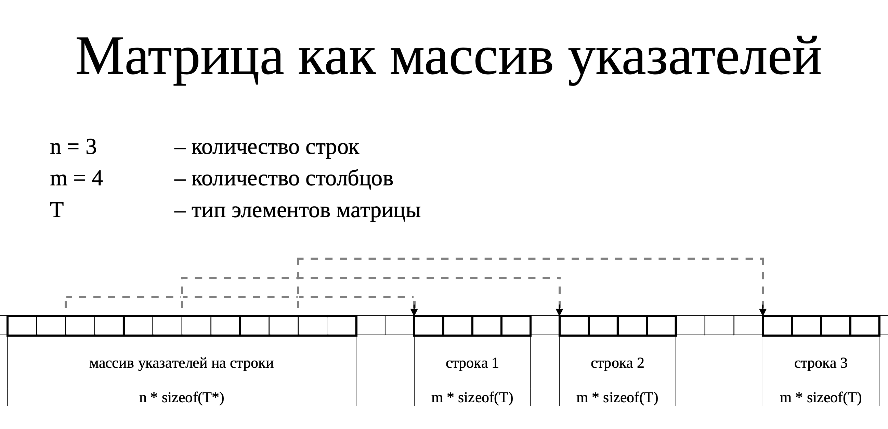
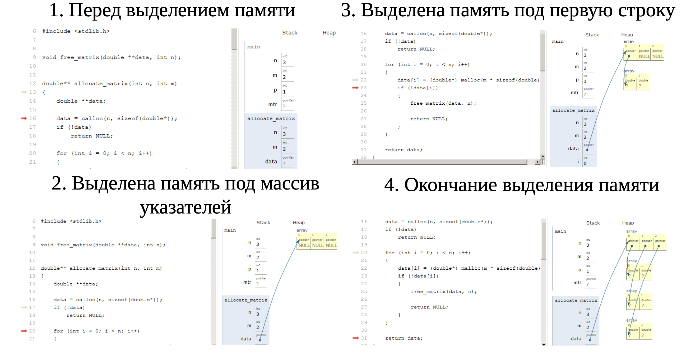
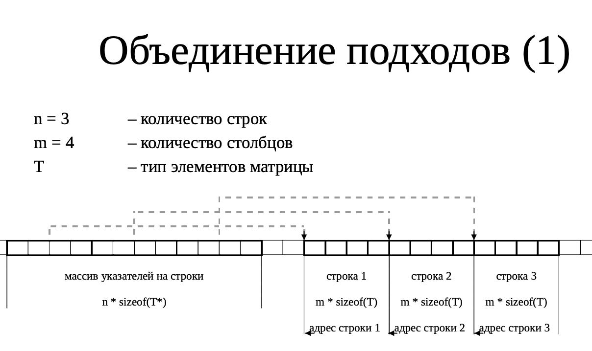

# Практика темы "Динамические матрицы"

## 1. Матрица как одномерный массив

Представление в памяти


**Выделение памяти**
```c
err_t create_matrix(matrix_t *matrix, int n, int m)
{
    if (n < 1 || m < 1)
    {
        return ERR_SIZE;
    }
    if (matrix == NULL)
        return ERR_ARGS;

    matrix->matrix = malloc(sizeof(int) * n * m);
    if (matrix->matrix == NULL)
        return ERR_MEM_ALLOC;

    matrix->n = (size_t)n;
    matrix->m = (size_t)m;
    return ERR_OK;
}
```

**Освобождение памяти**
```c
void free_matrix(matrix_t *matrix)
{
    if (matrix->matrix)
    {
        free(matrix->matrix);
    }
}
```

**Обращение к элементам**
```c
matrix.matrix[i * matrix.n + j]
```

### Примущества
- Простота выделения памяти
- Возможность использовать, как одномерный массив

### Недостатки
- Отладчик использованя памяти (valgrind) не может отследить обращение за пределы строки
- Нужно писать `[i * n + j]` – Нет синтаксического сахара

## 2. Матрица как массив указателей
Иной подход, мы выделяем память под массив указателей. В массиве будут храниться указатели на выделенные массивы для строк матрицы (массив)


Представление в памяти – указатель на массив хранится в стеке, все остальное в куче.


**Выделение памяти**
```c
err_t create_matrix(matrix_t *matrix, int n, int m)
{
    if (n < 1 || m < 1)
    {
        return ERR_SIZE;
    }
    if (matrix == NULL)
        return ERR_ARGS;

    matrix->matrix = calloc((size_t)n, sizeof(int)); // Юзаю calloc(), чтобы можно было спокойно сделать free(matrix->matrix[i])
    if (matrix->matrix == NULL)
        return ERR_MEM_ALLOC;

    for (size_t i = 0; i < (size_t)n; i++)
    {
        matrix->matrix[i] = calloc((size_t)m, sizeof(int));
        if (matrix->matrix[i] == NULL)
        {
            free_matrix(*matrix);
            return ERR_MEM_ALLOC;
        }
    }

    matrix->n = (size_t)n;
    matrix->m = (size_t)m;
    return ERR_OK;
}
```

**Освобождение памяти**
```c
void free_matrix(matrix_t matrix)
{
    // Освобождаем все строки, потом освобождаем массив указателей
    if (matrix.matrix)
    {
        for (size_t i = 0; i < matrix.n; i++)
        {
            free(matrix.matrix[i]);
        }
        free(matrix.matrix);
    }
}
```

### Примущества
Исправляются недостатки предыдущего способа
- Можно обращаться к элементам a[i][j]
- Отладчики памяти `(valgrind)` могут отследить выход за пределы массива
- Можно обменять элементы с помощью обмена указателей
### Недостатки
- Используется бОльший объем памяти, чем при статическом выделении памяти, из-за того что нужно хранить массив указателей
- *(Из лекции) Сложность выделения и освобождения памяти (хз где сложность)*
- Память под матрицу не лежит одной областью

## Объеденение подходов 1



### Примущества
- Относительная простота выделения и освобождения
памяти. *(Я 10 минут пытался понять что происходит)*
- Возможность использовать как одномерный массив.
- Перестановка строк через обмен указателей. *(Из лекции) "Возможно ошибка"*
### Недостатки
- Относительная сложность начальной инициализации.
- Отладчик использования памяти не может отследить выход
за пределы строки.

# Источники
1. Лекции МГТУ им Н.Э. Баумана, каф. Программная Инженерия.