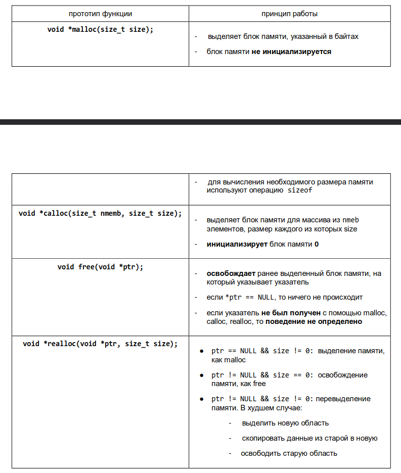

# Теория для подготовки к экзамену по си в 3 семестре

- [Теория для подготовки к экзамену по си в 3 семестре](#теория-для-подготовки-к-экзамену-по-си-в-3-семестре)
- [`1` Указатель на void. Стандартные функции обработки](#1-указатель-на-void-стандартные-функции-обработки)
  - [Используется](#используется)
  - [Особенности использования](#особенности-использования)
  - [Функции обработки памяти](#функции-обработки-памяти)
- [`2` Функции динамического выделения памяти.](#2-функции-динамического-выделения-памяти)
  - [Особенности](#особенности)
  - [Описание функций](#описание-функций)
  - [+/- Явного приведения](#--явного-приведения)
  - [Выделение 0 Байт памяти](#выделение-0-байт-памяти)
  - [Обработка NULL, возвращаемого функцией // Подходы к обработке ситуации отсутствия свободной памяти при выделении.](#обработка-null-возвращаемого-функцией--подходы-к-обработке-ситуации-отсутствия-свободной-памяти-при-выделении)
- [`3`  Выделение памяти под динамический массив, передача массива в функцию. Типичные ошибки при работе с динамической памятью](#3--выделение-памяти-под-динамический-массив-передача-массива-в-функцию-типичные-ошибки-при-работе-с-динамической-памятью)
- [`4` Указатели на функцию. Функция `qsort`.](#4-указатели-на-функцию-функция-qsort)
  - [Использование](#использование)
  - [Описание указателя на функцию](#описание-указателя-на-функцию)
  - [Особенности использования](#особенности-использования-1)
  - [qsort](#qsort)
- [`5` Утилита make. Назначение, простой сценарий сборки](#5-утилита-make-назначение-простой-сценарий-сборки)
  - [Разновидности Make](#разновидности-make)
  - [Флаги Make](#флаги-make)
  - [Цели](#цели)
  - [Простой сценарий](#простой-сценарий)
  - [Алгоритм работы](#алгоритм-работы)
- [`6` Утилита make. Назначение. Переменные и шаблонные правила.](#6-утилита-make-назначение-переменные-и-шаблонные-правила)
  - [Неявные правила и переменные](#неявные-правила-и-переменные)
  - [Шаблонные правила. Примеры использования.](#шаблонные-правила-примеры-использования)
- [`7` Утилита make. Условные конструкции и анализ зависимостей.](#7-утилита-make-условные-конструкции-и-анализ-зависимостей)
  - [Переменные, зависящие от цели. Примеры использования.](#переменные-зависящие-от-цели-примеры-использования)
- [`8` Что такое variable length array](#8-что-такое-variable-length-array)
  - [Особенности](#особенности-1)
  - [Функция alloca()](#функция-alloca)
  - [Сравнение](#сравнение)
- [`9` Динамические матрицы. Представление в виде одномерного массива и в виде массива указателей на строки. Анализ преимуществ и недостатков.](#9-динамические-матрицы-представление-в-виде-одномерного-массива-и-в-виде-массива-указателей-на-строки-анализ-преимуществ-и-недостатков)
- [`14` Чтение сложных объявлений.](#14-чтение-сложных-объявлений)
  - [Основные правила](#основные-правила)
  - [Примеры](#примеры)
- [`15` Строки в динамической памяти. Функции POSIX и](#15-строки-в-динамической-памяти-функции-posix-и)
  - [`strdup()`](#strdup)
  - [`getline()`](#getline)
  - [`asprintf()`](#asprintf)


# `1` Указатель на void. Стандартные функции обработки 
## Используется
```Для чего используется указатель на void? Приведите примеры.
Каковы особенности использования указателя на void? Приведите примеры.
Функции memcpy, memmove, memcmp, memset: назначение, особенности использования
примеры использования
```

Указатель на void используется для 
- Ссылки на произвольный участок памяти, независимо от его содержимого  
`void *memcpy(void *dst, const void *src, size_t n)`  
Таким образом, нас интерисует только то, где размещается память и ее размер  
- Позволяет передать в функцию указатель на объект любого типа (кроме указателя на функцию)  
`void qsort(void *arr, size_t number, size_t size, int (*comparator)(const void *l, const void *r))`

## Особенности использования
- Допускаивается присваивание без явного приведения типов
```c
int a = 1;
int *pa = &a;
void *pv = pa;
int *pb = pv;
```
- Указатель на void нельзя разыменовать, так неизвестен размер того типа, на который он указывает
- Указатель на void нельзя привести к указателю на функцию (можно через костыль) и наоброт. `*(void **)pfunc = pvoid;`
- К указателю на void не применима адрессная арифметика, так как не известен его размер.

## Функции обработки памяти
| Функция                                                                     | Описание                                                                                                                                                                                                                                              |
| --------------------------------------------------------------------------- | ----------------------------------------------------------------------------------------------------------------------------------------------------------------------------------------------------------------------------------------------------- |
| `void *memcpy(void *restrict dst, const void *restrict src, size_t count) ` | Копирует `count` байтов блока памяти `src`, во второй блок памяти `dst`. `UB` при - Перекрывании блоков памяти - Неделйствительных блоков. Возвращает указатель на `dst`                                                                              |
| `void *memove(void *restrict dst, const void *src, size_t count)`           | Функция копирует число байт `count` из `src` в `dst`. Возвращается указатель на `dst`. Копирование происходит через буфер, что позволяет исользовать функцию при перекрытии областей памяти. `UB` при недействительных указателях.                    |
| `int memcmp(const void *s_1, const void *s_2, size_t count)`                | Сравнивает первые `count` байт блока памяти указателя `s_1` с первыми `count` байт блока памяти указателя `s_2`. `UB` При -недействительных указателях.<br>Возвращает - 0: Содержимое равно<br> > 0 - Первый блок больше<br>< 0  - Второй блок больше |
| `void *memset(void *dst, int c, size_t n)`                                  | Заполняет `count` байт по адресу `dst` символом `c`. Возвращает указатель на `dst`.                                                                                                                                                                   |


# `2` Функции динамического выделения памяти.
```
Функции для выделения и освобождения памяти malloc, calloc, free.
Порядок работы и особенности использования этих функций.
Функция realloc. Особенности использования.
Общие «свойства» функций malloc, calloc, realloc.
Функция выделения памяти и явное приведение типа: за и против.
Особенности выделения 0 байт памяти.
Способы возвращения динамического массива из функции.
Типичные ошибки при работе с динамической памятью (классификация, примеры).
Подходы к обработке ситуации отсутствия свободной памяти при выделении.
```
## Особенности
- Все функции находятся в `stdlib.h`
- Функции не создают переменную, они лишь выделяют область памяти
- В качестве результата функции возвращают адрес расположения этой области в памяти компьютера, те `указатель`
- Возвращается указатель на `void`
- В случае ошибки при выделении памяти возвращется `NULL`
- После использования необходимо освободить память с помощью `free()`

## Описание функций

## +/- Явного приведения
`char *string = (char *)malloc(10);`
| +                                                  | -                                                                   |
| -------------------------------------------------- | ------------------------------------------------------------------- |
| Совместимость с C++                                | Начиная с `ANSI C` приведение не нужно                              |
| У `malloc` до `ANSI` C был прототип `char *malloc` | Может скрыться ошибка, если не подключен `stdlib.h`                 |
| Дополнительная самопроверка                        | В случае изменения типа указателя, придется менять тип в приведении |

## Выделение 0 Байт памяти
Результата вызова `malloc`, `calloc` и `realloc`, когда запрашиваемый размер блока равен 0 байт, зависит от компилятора.
- Вернет нулевой указатель
- Вернется "Нормальный" указатель, но его нельзя использовать для разыменования
Поэтомуц перед вызовом нужно проверить размер.

В случае `realloc`, при 0 байт, функция будет работать как `free()`

## Обработка NULL, возвращаемого функцией // Подходы к обработке ситуации отсутствия свободной памяти при выделении.
- Отладчик Valgrind
- Возвращаение ошибки
- Ошибка сегментации (segfault)
- Аварийное завершение (abort)
- Восстановление (recovery) - `xmalloc` из git

# `3`  Выделение памяти под динамический массив, передача массива в функцию. Типичные ошибки при работе с динамической памятью 
Можно передавать как возвращаемое значение, а можно пол указателю
```c
int create_arr(int **arr, size_t count);
int *create_arr(size_t count);
```
Типичные ошибки  
- Неверный расчет кол-ва выделяемой памяти 
- Отсутствие проверки на NULL после выделения памяти 
- Утечки памяти 
- Wild pointer: использование неинициализированного указателя 
- Dangling pointer: использование указателя сразу же после освобождения 
- Изменение указателя, который вернула функция выделения памяти
- Двойное освобождение памяти 
- Освобождение не выделенной памяти или не динамической памяти
- Выход за границы динамического массива

# `4` Указатели на функцию. Функция `qsort`.
*   Рассказать, для чего в языке Си используются указатели на функцию.
*   Привести примеры,
*   Рассказать, как описываются указатели на функцию,
*   Как они инициализируются,
*   Как с их помощью вызывается сама функция,
*   Рассказать про функцию `qsort`,
*   Привести какие-то примеры использования,
*   Остановиться на особенностях использования указателей на функцию,
*   Затронуть вопрос указателей на функцию и адресной арифметики,
*   Рассказать про указатели на функцию и указатели на `void`.

## Использование
Указатели на функции используются для


**Функция обратного вызова (callback)** - Передача функции через параметры
```c
void populate_array(int *arr, size_t size, int (*get_next_value)(void))
{
  for (size_t i = 0; i < size; i++)
  {
    array[i] = get_next_value();
  }
}

int get_next_value(void)
{
  return rand();
}
```

**Таблица переходов** - метод передачи управления программой другой части программы.

```c
typedef void (*handler_fn)(void)

void func3(void) {printf("3\n");}
void func2(void) {printf("2\n");}
void func1(void) {printf("1\n");}
void func0(void) {printf("0\n");}

handler_fn jump_table[4] = {func0, func1,func2,func3};

int main(int argc, char **argv)
{
  int value;

  value = atoi(argv[1]) % 4
  if (value < 0)
    value *= -1;

  jump_table[value]();
  return 0;
}
```

**Динамическое связывание** - Подключение к программе предварительно откомпилированного файла динамической библиотеки

## Описание указателя на функцию
```c
// <Возвращаемый тип> (*<идентификатор>)(<передаваемые параметры>)
typedef Возвращаемый_тип (*идентификатор_fn)(передаваемые параметры)
// Примеры
void (*list_apply_fn)(list_t *list, void *arg);

// Описание функций
void list_apply(list_t *list, void *arg, list_apply_fn func);
// Вызов
list_apply(list, arg, print_arr);
list_apply(list, arg, &print_arr);
// Вызов функции по указателю
y = func(x);
y = (*func)(x);
```
## Особенности использования
- Выражение из имени функции **неявно преобразуется в указатель на функцию**
```c
int add(int a, int b);
int (*p1)(a, b) = add;
```
- Операция `&` для функции возвращает указатель на функцию, но это лишняя операция
```c
int add(int a, int b);
int (*p1)(a, b) = &add // add;
```
- Операция `*` для указателя возвращает саму функцию, которая неявно преобразуется в указатель на функцию
```c
int (*p3)(int, int) = *add; 
int (*p4)(int, int) = *****add;
```
- Указатели на функции можно сравнивать
```c
if (p1 == add)
  printf("eq");
```
- Указатель на функцию может быть возвращемым значением
- При применении адрессной арифметики, указатель может указаывать уже на другое место в памяти.
- Указатель на void нельзя привести к указателю на функцию и наоборот (можно через костыль `*(void **)pfunc = pvoid`)

## qsort
```c
void qsort(void *base, size_t nmemb, size_t size, int (*compare)(const void *, const void *));
// base - Указатель на первый элемент масива
// nmemb - Количество элементов
// size - Размер
// compare - Функция компаратор

// ИСПОЛЬЗОВАНИЕ на примере сортировки массива целых чисел
int compare(const void *a, const void *b)
{
  return *(int *)a - *(int *)b
}

#define LEN 10
int main(void)
{
  int a[LEN];
  for (size_t i = 0; i < LEN; i++)
  {
    a[LEN - 1 - i] = i;
  }

  qsort(a,  sizeof(a) / sizeof(a[0]), sizeof(a[0]), compare);
}
```

# `5` Утилита make. Назначение, простой сценарий сборки
*   Рассказать, для чего предназначена утилита `make`,
*   Какие у нее входные данные,
*   Какая идея лежит в основе её работы,
*   Какие разновидности утилиты `make` существуют,
*   Привести простой сценарий сборки,
*   Рассказать, как утилита `make` этот сценарий обрабатывает при чистом запуске и после сборки,
*   Рассказать про ключи запуска этой утилиты.
  
`Make` - утилита для автоматизации компиляции программы.
Правила преобразования задаются в файле с названием `makefile`, который должен находится в корне проекта. Утилита make использует скрипт из make-file и время последнего изменения файла, для того, чтобы решить какие файлы нужно обновить.
**Принцип работы**
makefile описывает
- Отношение между файлами
- Компанды для обновления (компиляции) каждого файла
  
Сам скрипт состоит из набора правил, которые в свою очередь описываются:
- целями (что нужно сделать)
- Зависимостями (что нужно сделать для запуска команды)
- Командами (то, как нужно собрать)

## Разновидности Make
- Gnu make
- BSD make
- nmake (Micrisoft make) - Работает под Windows, мало функциональным

## Флаги Make
- `-f` используется для указания имени файла сценария сборки
- `-B` используется для безусловного выполнения правил
- `-n` используется для вывода команд без их выполнения
- `-i` используется для игнорирования ошибок при выполнении команд

## Цели

```c
цель : зависимость
  comand1
  comand1
```
`Абстрактная цель (phony target)` - это цель, которая не является на самом деле именем файла. Это просто название некоторой последовательности команд. 
Чтобы make даже не думал интерпретировать это как цель, используется ключевое слово `.PHONY`  

`Правило (rule)` описывает, когда и каким образом следует обновлять файлы, указанные в нем в качестве создания или обновления цели


## Простой сценарий
```make
app.exe : main.o test.o
  $(CC) $(LDFLAGS) main.o test.o -o app.exe

main.o : main.c test.c test.h
  $(CC) $(CFLAGS) -c main.c -o main.o

  test.o : test.c test.h
  $(CC) $(CFLAGS) -c test.c -o test.o
```

## Алгоритм работы
- `make` начинает выполнять первое правило, видит зависимости test.o и main.o
- После этого, `make` начинает выполнять цели `main.o` и `test.o`, Выполняется команды, в результате появляются объектные файлы. Рекурсия начинает сворачиваться, возвращаемся в `app.exe`. Все зависимости выполлнены > выполняется команда. В результате появлятеся исполняемый файл.

При чистом запуске все команды выполняются. При повторном запуске, если время изменения файла .c раньше чем создание файла .o, то команда не выполняется.

# `6` Утилита make. Назначение. Переменные и шаблонные правила.
- Рассказать о переменных (обычные, неявные, автоматические). Остановиться на всех разновидностях переменных, рассказать, как ими пользоваться, для чего они нужны
- Рассказать про шаблонные правила.

## Неявные правила и переменные
**Неявные правила (implicit rules)** указывают make на некоторые "стандартные" приемы обработки файлов, дабы пользователь мог использовать их, не занимаясь каждый раз детальным описанием способа обработки.

*Имена файлов определяют, какие неявные правила вступают в действие. Например, при C-компиляции обычно берется файл с именем, оканчивающемся на '.c' и порождается файл с именем, оканчивающемся на '.o'. Таким образом, программа make применяет неявное правило для C-компиляции, когда она обнаруживает эту комбинацию окончаний имен файлов.*
- `-p` – показывает неявные правила и переменные 
- `-r` – запрещает использовать неявные правила

```make
OBJS := hello.o bye.o 
  
app.exe: $(OBJS) main.o 
 $(CC) -o app.exe $(OBJS) main.o 
 
clean: 
 rm *.o *.exe
```
заранее определенные переменные
- CC
- CFLAGS
- LDFLAGS

Обычные переменные
`OBJS := hello.o bye.o`
`$(OBJS)`

Автоматические переменные
- $@ - имя цели
- $< - Первая зависимость
- $^ - Все зависимости 
  
**Пример**
```make
main.o: main.c
  $(CC) $(CFLAGS) -c $< -o $@
```
## Шаблонные правила. Примеры использования.
`Шаблонные правила применяются ко всем файлам, соответствующим определенному шаблону.  `
- **Синтаксис:**  
```make
%.o: %.c
  gcc -c $< -o $@
```
- **Пример:**  
```make
CC = gcc
CFLAGS = -Wall

app: main.o utils.o
  $(CC) $(CFLAGS) -o $@ $^

%.o: %.c
  $(CC) $(CFLAGS) -c $< -o $@
```
- **Преимущества шаблонных правил:**  
  - Уменьшают размер `Makefile`.  
  - Упрощают добавление новых файлов.  
  
# `7` Утилита make. Условные конструкции и анализ зависимостей.
- Рассмотреть 2 подхода к реализации условных конструкций (директивы условные, цели, переменные, которые зависят от целей),
- Рассмотреть анализ зависимостей в утилите make (ручной анализ зависимостей, подход, когда любой C-файл зависит от всех заголовочных файлов, автоматическая генерация зависимостей).
  
В `Makefile` можно использовать условные конструкции для выполнения различных действий в зависимости от заданных переменных или условий.
```make
ifeq(cond1, cond2)
  command
else
  command2
endif
```

- **Пример**
```make
DEBUG := 1

ifeq ($(DEBUG), 1)
  CFLAGS = -g -Wall
else
  CFLAGS = -O2
endwif
```
- **Другие формы условий:**
- `ifneq`: Для проверки неравенства.  
- Использование проверок на существование файлов:  
```make
ifneq ($(wildcard config.h),)
  CFLAGS += -DHAS_CONFIG
endif
```

## Переменные, зависящие от цели. Примеры использования.
Переменные могут задаваться для отдельных целей. Это позволяет применять специфические флаги или команды.  
- **Формат:**
```make
target: CFLAGS = -O2
target: dependencies
  команда
```
- **Пример:**
```make
debug: CFLAGS = -g
debug: app

release: CFLAGS = -O2
release: app

app: main.o
  gcc $(CFLAGS) -o app main.o
```
**При вызове:**
```bash
make debug   # Собирает с отладочными флагами (-g).
make release # Собирает с оптимизацией (-O2).
```

17. **Автоматическая генерация зависимостей.**  
Чтобы автоматизировать создание зависимостей (`.o` -> `.c` и заголовочных файлов), используются утилиты, такие как `gcc` с флагом `-M`.  

- **Пример генерации зависимостей:**
```bash
gcc -MM main.c > main.d
```
Суть автоматической генерации зависимостей – в получении универсального make-файла, который можно будет использовать в разных проектах  
`-M:` Для каждого файла с исходным текстом препроцессор будет выдавать на  стандартный вывод список зависимостей в виде правила для программы make. В список зависимостей попадает сам исходный файл, а также все файлы, включаемые с помощью директивы `#include`. После запуска препроцессора компилятор останавливает работу, и генерации объектных файлов не происходит. После того как файлы зависимостей сформированы, нужно сделать их доступными утилите make. Этого можно добиться с помощью директивы include.
- **Интеграция в `Makefile`:**
```make
CC = gcc
CFLAGS = -Wall
DEPENDS = main.d utils.d

-include $(DEPENDS)

%.d: %.c
  $(CC) -MM $< > $@

%.o: %.c
  $(CC) $(CFLAGS) -c $< -o $@
```

Я делал следующим образом: 
```make
CFLAGS := ... -I$(INC_DIR)/
```

**Функции в `make`.**  
Функции `make` позволяют работать со строками, списками и именами файлов.  

    - **Примеры функций:**
      - `wildcard`: Получение списка файлов, соответствующих шаблону.  
        ```make
        SOURCES = $(wildcard *.c)
        ```
      - `patsubst`: Замена в строке по шаблону.  
        ```make
        OBJECTS = $(patsubst %.c, %.o, $(SOURCES))
        ```
      - `addprefix`: Добавление префикса к каждому элементу списка.  
        ```make
        OBJS = $(addprefix obj/, $(OBJECTS))
        ```
      - `notdir`: Получение имени файла без пути.  
        ```make
        FILENAMES = $(notdir $(SOURCES))
        ```

    - **Пример полного использования:**
      ```make
      CC = gcc
      CFLAGS = -Wall
      SOURCES = $(wildcard src/*.c)
      OBJECTS = $(patsubst src/%.c, obj/%.o, $(SOURCES))

      app: $(OBJECTS)
          $(CC) $(CFLAGS) -o $@ $^

      obj/%.o: src/%.c
          $(CC) $(CFLAGS) -c $< -o $@
      ```

# `8` Что такое variable length array
- Чем отличается статический массив от variable length array?
- Какую операцию языка Си пришлось реализовывать по-другому (не как для встроенных типов) специально для variable length array?
- Особенности использования variable length array.
- Справедлива ли для variable length array адресная арифметика?
- Как вы думаете почему variable length array нельзя инициализировать?
- Для чего используется variable length array? Приведите примеры.
- В какой области и «кем» выделяется память под массив переменной длины?
- Функция alloca. alloca vs VLA

`variable length array` - массив, с размером, определяемым во время выполнения ```int a[n]``` 
## Особенности
- Длина масива вычисляется в рантайме
- Память под VLA выделяется на стеке
- Массив автоматически освобождается, когда выполнение программы, выходит за область видимости массива
- Массивы переменного размера нельзя инициализировать при определении
- Массивы переменной длины могут быть многомерной
- Для VLA справедлива адрессная арифметика
- Размер должен быть строго положительным
- Память выделяется в стеке, который имеет ограниченный размер. Это может привести к stack overflow, если VLA слишком велик.

```c
#include <stdio.h> 
void print_array(int n)  
{ 
int arr[n]; // VLA 
// int arr[n] = {1, 2, 3, 4, 5}; // Ошибка
for (int i = 0; i < n; i++) 
        arr[i] = i * i; 
for (int i = 0; i < n; i++) 
printf("%d ", arr[i]); 
printf("\n"); 
} 
int main()  
{ 
    print_array(5); // Создаст массив размера 5 
    print_array(3); // Создаст массив размера 3 

return 0; 
} 
```

## Функция alloca()
`alloca (allocate on stack)` — это функция для выделения памяти в стеке во время выполнения программы. Память автоматически освобождается, когда выполнение выходит за пределы текущего фрейма стека

`void *alloca(size_t size);`
Заголовочный файл: `<stdlib.h>` или `<alloca.h>` (зависит от платформы, в лекциях было `<alloca.h>`).

**Особенности**
- Память выделяется динамически, как в malloc(), но освобождается автоматически
- Работает только в текущем кадре стека.
  
**Недостатки**
- Если запрашиваемая память > свободная - `UB`
- Указатель на массив нельзя использовать за пределами стека
- Не стандартизирована: это GNU/Platform-specific extension, а не часть стандарта языка C

**Пример**

```c
#include <stdlib.h>
#include <stdio.h> 
void print_array(int n)  
{ 
int *arr = alloca(n * sizeof(int)); // Выделение памяти в стеке 
for (int i = 0; i < n; i++) 
        arr[i] = i * i; 
for (int i = 0; i < n; i++) 
  printf("%d ", arr[i]); 
printf("\n"); 
} 

int main()  
{ 
    print_array(5); // Выделяет массив из 5 элементов в стеке 
    print_array(10); // Выделяет массив из 10 элементов в стеке 
return 0; 
} 
```
## Сравнение
| Критерий            | VLA                                                   | alloca                                                |
| ------------------- | ----------------------------------------------------- | ----------------------------------------------------- |
| Стандарт            | введен в с99                                          | нет в стандарте (есть в GNU99)                        |
| Выделение памяти    | Автоматически выделяется в стеке                      | Автоматически выделяется в стеке                      |
| Освобождение памяти | Освобождается автоматически при выходе из кадра стека | Освобождается автоматически при выходе из кадра стека |
| Размер массива      | Определяется во время выполнения                      | Задается как аргумент `alloca`                        |
| Инициализация       | Нельзя инициализировать при объявлении                | Память не иницализирована                             |
| Контроль ошибок     | Нету, можно получить Stack Overflow                   | Нету, можно получить Stack Overflow                   |
| Гибкость            | Можно использовать только для масивов                 | Можно использовать для любых данных                   |

# `9` Динамические матрицы. Представление в виде одномерного массива и в виде массива указателей на строки. Анализ преимуществ и недостатков.
- Рассказать про представление динамической матрицы в виде одномерного массива.
- Рассказать про представление динамической матрицы в виде массива указателей на строки.
- Рассказать, как динамическая матрица в том или ином представлении представлена в памяти компьютера, нарисовать картинку,
- Рассмотреть алгоритм выделения памяти под матрицу,
- Рассмотреть алгоритм освобождения памяти,
- Проанализировать эти два представления с точки зрения преимуществ и недостатков в виде таблички.

# `14` Чтение сложных объявлений.
- Рассказать о правилах чтения сложных объявлений в языке Си,
- Упомянуть, что есть словарик и сами правила,
- Привести пару примеров, показывающих умение читать эти самые сложные объявления.
- Остановиться на тех ситуациях, которые в процессе чтения возникнуть не должны.

## Основные правила
1. Начинать читать с имени индентификатора, затем двигаемся вправо, когда можем, а потом влево
2. Приоритеты операций
- Скобки (): вызов функции.
- Квадратные скобки []: массив.
- Звёздочка *: указатель
3. Словарик
- * — указатель на.
- () — функция, возвращающая.
- [] — массив.
- const — неизменяемый.

## Примеры

arr — это указатель на массив из 10 элементов типа int.
```c
int (*arr)[10]; 
```

arr —  это массив из 5 указателей на функции, которые принимают double и возвращают
 int.
```c
int (*funcs[5])(double); 
```
# `15` Строки в динамической памяти. Функции POSIX и
- Рассмотреть функции: `strdup`, `getline`, `asprintf`.
- Рассказать про эти функции и особенности их работы.
- Знать, как их функциональность реализовать самостоятельно.
- Рассказать про Feature Test Macros (что это, для чего нужно).

## `strdup()`
**Описание**
- Создает копию строки, автоматически выделяя память
- Реализована в стандарте POSIX
```c
char *strdup(const char *s)
```
**Особенности**
- Возвращает указатель на новую строку, идентичной переданной
- Память копии выделяется с помощью `malloc`
- Возвращается `NULL` при неудачном выделении

**Пример**
```c
#define _GNU_SOURCE
#include <string.h>
#include <stdio.h>
#include <stdlib.h> 
int main()  
{ 
  const char *original = "Hello, World!"; 
  char *copy = strdup(original); 
  if (!copy)  
  { 
    perror("strdup failed"); 
    return 1; 
  } 
  printf("Original: %s\nCopy: %s\n", original, copy); 
  free(copy); // Не забывайте освобождать память! 
  return 0; 
 } 
```

**Самостоятельная реализация**
```c
char *my_strdup(const char *s)
{
  size_t len = strlen(s) + 1;
  char *copy = malloc(len);
  if (copy == NULL)
    return NULL
  
  memcpy(copy, s, len);
  return copy;
}
```

## `getline()`
**Описание**
- Функция считатывает строку из файла ввода до символа новой строки или EOF и записывает ее в динамическую память
- Реализована в стандарте POSIX
```c
ssize_t getline(char **lineptr, size_t *n, FILE *stream);
```
**Особенности**
- Если `lineptr` = `NULL`, то выделяет память
- Если память уже выделена, автоматически увеличивает её при необходимости.
- Возвращает количество символов, считанных (включая \n, но исключая завершающий \0)
- Возвращает -1 при ошибке или достижении конца файла

**Пример**
```c
#define _GNU_SOURCE
#include <string.h>
#include <stdio.h>
#include <stdlib.h> 
int main()  
{ 
  char *line = NULL; 
  size_t len = 0; 
  printf("Enter a line of text: "); 
  if (getline(&line, &len, stdin) == -1 ); 
  { 
    perror("getline failed"); 
    free(line); 
    return 1; 
  } 

  printf("You entered: %s", line); 
  free(line); 
  return 0; 
} 
```

**Самостоятельная реализация**
```c
ssize_t my_getline(char **lineptr, size_t *n, FILE *stream)  
{ 
  if (!lineptr || !n || !stream)
    return -1; 

  size_t pos = 0; 
  int c; 
  if (*lineptr == NULL || *n == 0)  
  { 
    *n = 128; 
    *lineptr = malloc(*n); 
    if (*lineptr == NULL)  
      return -1; 
  } 

  while ((c = fgetc(stream)) != EOF)  
  { 
    if (pos + 1 >= *n)  
    { 
      *n *= 2; 
      char *new_ptr = realloc(*lineptr, *n); 
      if (new_ptr == NULL)  
        return -1; 
      
      *lineptr = new_ptr; 
    } 
    (*lineptr)[pos++] = c; 
    if (c == '\n')  
      break; 
  } 
  if (pos == 0 && c == EOF)  
    return -1; 
  
  (*lineptr)[pos] = '\0'; 
  return pos;
}
```

## `asprintf()`
**Описание**
-  Форматирует строку, записывая её в массив. Отличие от sprintf заключается в том, что данная функция берет на себя задачу выделения памяти под результирующую строку.
-  Является частью `GNU Extensions`, требует `Future Test Macros`
```c
ssize_t getline(char **lineptr, size_t *n, FILE *stream);
```
**Особенности**
- Если `lineptr` = `NULL`, то выделяет память
- Если память уже выделена, автоматически увеличивает её при необходимости.
- Возвращает количество символов, считанных (включая \n, но исключая завершающий \0)
- Возвращает -1 при ошибке или достижении конца файла

**Пример**
```c
#define _GNU_SOURCE
#include <string.h>
#include <stdio.h>
#include <stdlib.h> 
int main()  
{ 
  char *line = NULL; 
  size_t len = 0; 
  printf("Enter a line of text: "); 
  if (getline(&line, &len, stdin) == -1 ); 
  { 
    perror("getline failed"); 
    free(line); 
    return 1; 
  } 

  printf("You entered: %s", line); 
  free(line); 
  return 0; 
} 
```

**Самостоятельная реализация**
```c
ssize_t my_getline(char **lineptr, size_t *n, FILE *stream)  
{ 
  if (!lineptr || !n || !stream)
    return -1; 

  size_t pos = 0; 
  int c; 
  if (*lineptr == NULL || *n == 0)  
  { 
    *n = 128; 
    *lineptr = malloc(*n); 
    if (*lineptr == NULL)  
      return -1; 
  } 

  while ((c = fgetc(stream)) != EOF)  
  { 
    if (pos + 1 >= *n)  
    { 
      *n *= 2; 
      char *new_ptr = realloc(*lineptr, *n); 
      if (new_ptr == NULL)  
        return -1; 
      
      *lineptr = new_ptr; 
    } 
    (*lineptr)[pos++] = c; 
    if (c == '\n')  
      break; 
  } 
  if (pos == 0 && c == EOF)  
    return -1; 
  
  (*lineptr)[pos] = '\0'; 
  return pos;
}
```
